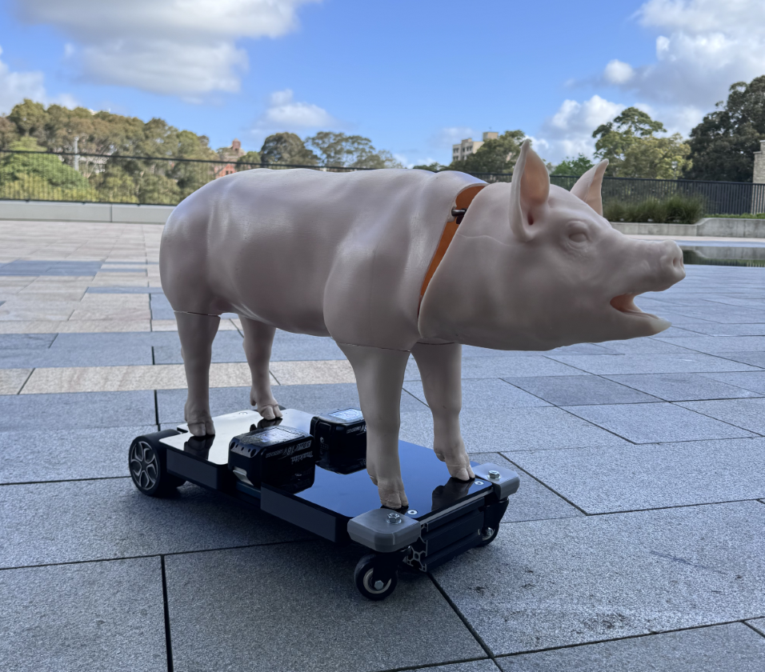
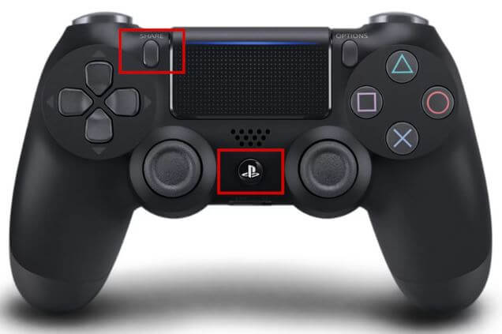

# HoverPig
This project is a remote controlled pig that is used for a teaching resoruce to train students in Vetinary science on how to snare and catch a pig.

## ESP32 Controller 🎮
To control the pig it uses a PS4 controller combined with a FREENOVE ESP32-WROOM and breakout board. It allows the user to use a PS4 controller to control outputs on the FREENOVE breakout board. Other controllers can be used, button assignments may need to be changed. When flashing the board select '_ESP32-WROOM-DA Module_' from the list of available boards manager. 

Once flashed the PS4 controller can be paired by pressing and holding the share button and playstation logo  simultaneously. 

Features:
- Users can trim the joystick position using R1 and L1 combined with the D-pad to trim the left and right joystick. This is implemented in the `GamepadController.cpp`. The remote should vibrate to indicate the trim is being adjusted. The trim is stored in `SPIFFS` as a `offsets.txt` file.

        L1 + D-pad Left will trim the left joystick left

- Users can upload upto 5 `.wav` audio file to the SD card. The files should be named `1.wav -> 5.wav` the program will cycle through the different audio files when you press the `X` button on the ps4 controller.

# Hardware
## Electronics
- [FREENOVE ESP32](https://vi.aliexpress.com/item/1005005776600877.html)

- [FREENOVE ESP32 Breakout](https://vi.aliexpress.com/item/1005005879655901.html)

- [Micro SD Card Reader](https://lonelybinary.com/products/micro-sd-reader-module-pack-of-3)

- [MAX98357 I2S DAC Decoder with 3W Amplifier](https://lonelybinary.com/products/max98357)

- [4 Ohm Speaker](https://vi.aliexpress.com/item/1005005699882165.html)

- Hoverboard Main Board that featrues a `STM32F103RCT6` or a `GD32F103RCT6` microcontroller

# Software
## Required Arduino ESP32 Board Libraries
 - [bluepad32 - V4.1.0](https://github.com/ricardoquesada/bluepad32)
 - [hoverboard-firmware-hack-FOC](https://github.com/EFeru/hoverboard-firmware-hack-FOC)
 
 __NOTE:__ Hoverboard Firmware changes `hoverboard-firmware-hack-FOC`:
- number of poles `n_polePairs` for skateboard hub motors in `/src/BLDC_controller_data.c` being "15u -> 20U"
- `CTRL_MOD_REQ` parameter changed in `/Inc/config.h` V `VLT_MODE -> SPD_MODE`

When flashing the hoverboard controller follow the steps provided on the github repository. Note that the hoverboards can be locked preventing flashing and will need to be unlocked using the [STM32CubeProgrammer Software](https://www.st.com/en/development-tools/stm32cubeprog.html). For information how to do this follow this [tutorial](https://youtu.be/77bMH5Ql1Xo?si=E0nV6sFRmLHlkzPF&t=290).

__NOTE:__ Not not all esp32 boards are compatible with the Bluetooth gamepads see compatible boards and gamepads below. For more information see [docs](https://bluepad32.readthedocs.io/en/latest/supported_gamepads/).

_Most gamepads, as of 2024, use BR/EDR (AKA Bluetooth Classic). Only a few use BLE. Worth noting is that BR/EDR is only supported on ESP32, Pico W and Pico 2 W, but NOT in ESP32-S3 / ESP32-C3 / ESP32-C6 / ESP32-H2._

| Chip       | BR/EDR | BLE |
|------------|--------|-----|
| ESP32      | ✔      | ✔   |
| ESP32-S3   |        | ✔   |
| ESP32-C3   |        | ✔   |
| ESP32-C6   |        | ✔   |
| ESP32-H2   |        | ✔   |
| Pico W     | ✔      | ✔   |
| Pico 2 W   | ✔      | ✔   |

_Non-comprehensive list of supported Bluetooth gamepads their protocols:_

| Gamepad                     | BR/EDR | BLE   |
|-----------------------------|--------|-------|
| DualSense (PS5)            | ✔      |       |
| DualShock 4 (PS4)          | ✔      |       |
| DualShock 3 (PS3)          | ✔      |       |
| Nintendo Switch Pro        | ✔      |       |
| Nintendo Switch JoyCons    | ✔      |       |
| Nintendo Wii U Pro         | ✔      |       |
| Nintendo Wii Remote        | ✔      |       |
| Nintendo Balance Board     | ✔      |       |
| Xbox Wireless              | ✔*     | ✔*    |
| Xbox Adaptive              |        | ✔*    |
| Steam                      | ✔**    |       |
| Stadia                     |        | ✔***  |
| Android                    | ✔****  | ✔**** |
| 8BitDo                     | ✔      |       |
| Atari                      | ✔      |       |
| iCade                      | ✔      |       |
| Nimbus                     | ✔      |       |
| OUYA 1st gen               | ✔      |       |

_*_ : Xbox Controller Firmware v3.x and v4.x use BR/EDR. Firmware v5.x and later use BLE.

_**_ : Requires Steam Controller Bluetooth firmware update

_***_ : Requires Stadia Bluetooth firmware update

_****_ : Some Android controllers use BR/EDR, some use BLE.

## Required Arduino Libraries
 - [ESP32-audioI2S - V3.0.12](https://github.com/schreibfaul1/ESP32-audioI2S)
